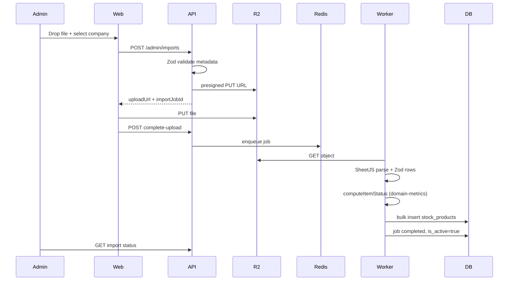

# Implementation Plan: Stock Import & Client Dashboard

**Branch**: `001-stock-import-dashboard` | **Date**: 2026-05-19 | **Spec**: [spec.md](./spec.md)  
**Input**: Planejar implementação da funcionalidade base conforme spec e constituição v1.0.0.

## Summary

Prudens Index base feature: Prudens admin uploads `.xlsx`/`.csv` stock files per client
company; worker processes via BullMQ + SheetJS; data persists in PostgreSQL; client
users view a mobile-first dashboard (table, Recharts, KPI cards, client-side filters)
and export PDF. Monorepo (`pnpm` workspaces): `apps/web`, `apps/api`, `apps/worker`,
`packages/shared`, `packages/domain-metrics`. Auth via Clerk (`admin` | `client`).
All business logic in services; calculations only in `@prudens/domain-metrics`.

## Technical Context

**Language/Version**: TypeScript strict — Next.js 15 (App Router), Node.js 20 LTS  
**Primary Dependencies**: Fastify, Drizzle, BullMQ, SheetJS, Zod, Shadcn/UI, Tailwind v4, Recharts, react-dropzone, Clerk, Zustand  
**Storage**: PostgreSQL 16, Redis 7, Cloudflare R2  
**Testing**: Vitest (unit/integration), Playwright (E2E smoke)  
**Target Platform**: Vercel (`apps/web`), Hetzner/Coolify Docker (`apps/api`, `apps/worker`)  
**Project Type**: web-service (mobile-first + API + worker)  
**Performance Goals**: Import → dashboard ≤60s; dashboard interactive ≤3s @5k rows; filters ≤500ms client-side; upload validation 100% pre-queue  
**Constraints**: Constitution stack; Route→Service→Repository; tenant isolation; R2 presigned only  
**Scale/Scope**: ~267 rows typical, up to 5,000 rows / 10 MB per import

## Constitution Check

*GATE: Pre-design — PASS | Post-design (Phase 1) — PASS*

| Gate | Status | Notes |
|------|--------|-------|
| Stack | PASS | User stack matches constitution; Clerk added (auth only) |
| Layer boundaries | PASS | Web → API → DB/Redis/R2; worker separate container |
| API sequence | PASS | All endpoints: route (Zod) → service → repository |
| Validation & auth | PASS | Zod + Clerk on all protected routes |
| Secrets & CORS | PASS | Env split documented; `NEXT_PUBLIC_*` allowlist only |
| DRY & naming | PASS | `packages/domain-metrics` owns calculations |
| Mobile-first | PASS | Shadcn responsive layouts; touch-friendly filters |

## Project Structure

### Documentation (this feature)

```text
specs/001-stock-import-dashboard/
├── plan.md
├── research.md
├── data-model.md
├── quickstart.md
├── contracts/
└── tasks.md          # /speckit.tasks
```

### Source Code (repository root)

```text
package.json                 # pnpm workspaces
pnpm-workspace.yaml
docker/docker-compose.yml    # postgres:16, redis:7
turbo.json                   # optional task runner

apps/web/                    # Next.js 15 @ Vercel
├── src/app/
│   ├── (auth)/sign-in/[[...sign-in]]/page.tsx
│   ├── (admin)/admin/imports/page.tsx
│   ├── (client)/dashboard/page.tsx
│   └── api/                 # BFF proxies if needed (no business logic)
├── src/components/          # PascalCase
├── src/lib/                 # apiClient.ts, clerk helpers — camelCase files
├── src/store/               # dashboardStore.ts (Zustand)
└── middleware.ts            # Clerk + role routes

apps/api/                    # Fastify @ Coolify
├── src/routes/              # kebab-case
├── src/services/
├── src/repositories/
├── src/plugins/             # auth, rate-limit, cors
└── drizzle/

apps/worker/                 # BullMQ consumer @ Coolify (separate container)
├── src/jobs/process-import.ts
└── src/services/            # reuses parsing via shared + calls domain-metrics

packages/shared/             # Zod schemas, types, spreadsheet headers
packages/domain-metrics/     # computeItemStatus, aggregation helpers (exported)
```

**Structure Decision**: Monorepo with three apps + two packages. Shared calculations
live in `packages/domain-metrics` to satisfy constitution V (single source of truth).

## Complexity Tracking

> No constitution violations requiring justification.

---

# Sequential Implementation Phases

## Phase 0 — Monorepo foundation & local dev

**Goal**: Runnable workspace with strict TypeScript, Docker infra, lint/format CI.

### Files & responsibilities

| Path | Responsibility |
|------|----------------|
| `package.json`, `pnpm-workspace.yaml` | Workspace roots: `apps/*`, `packages/*` |
| `packages/shared/tsconfig.json` | `strict: true` base config extended by apps |
| `apps/web`, `apps/api`, `apps/worker` | Scaffold with empty entrypoints |
| `docker/docker-compose.yml` | `postgres:16`, `redis:7`, volumes, internal network |
| `.eslintrc.cjs` (root) + `prettier.config.mjs` | Shared rules; `pnpm lint` / `pnpm format` |
| `.github/workflows/ci.yml` | `lint` → `typecheck` → `test` on PR |
| `turbo.json` | Pipeline: `build`, `lint`, `test` per package |

### Environment separation (baseline)

| Variable | `apps/web` | `apps/api` | `apps/worker` |
|----------|------------|------------|---------------|
| `DATABASE_URL` | — | yes | yes |
| `REDIS_URL` | — | yes | yes |
| `R2_*` | — | yes | yes |
| `CLERK_SECRET_KEY` | server only | yes | — |
| `NEXT_PUBLIC_CLERK_PUBLISHABLE_KEY` | yes | — | — |
| `NEXT_PUBLIC_API_URL` | yes (public URL) | — | — |

**Deliverable**: `pnpm install && docker compose up && pnpm typecheck` passes.

---

## Phase 1 — Authentication (Clerk) & route protection

**Goal**: Two profiles (`admin`, `client`), protected UI and API.

### Architecture

```text
Browser → Clerk session → apps/web middleware (role + route)
         → fetch API with Bearer JWT → apps/api auth plugin → service (tenant context)
```

### Files & responsibilities

| Path | Responsibility |
|------|----------------|
| `apps/web/middleware.ts` | `clerkMiddleware`; `/admin/*` requires `role=admin`; `/dashboard/*` requires `role=client` + `companyId` |
| `apps/web/src/app/(admin)/**` | Admin layout shell |
| `apps/web/src/app/(client)/**` | Client layout shell |
| `apps/api/src/plugins/auth.ts` | Verify Clerk JWT; attach `{ userId, role, companyId }` to request |
| `apps/api/src/services/auth-context-service.ts` | Resolve DB user; enforce admin vs client |
| `apps/api/src/repositories/user-repository.ts` | Drizzle lookup by `clerk_user_id` |

### Clerk metadata contract

```json
{
  "role": "admin | client",
  "companyId": "<uuid>"   // required when role=client
}
```

### API middleware behavior

- Missing/invalid JWT → `401`
- Client accessing admin routes → `403`
- `companyId` in token MUST match `company_id` on all client data queries

**Deliverable**: Unauthenticated users redirected; cross-role access blocked.

---

## Phase 2 — Database schema, migrations & seed

**Goal**: Drizzle schema for companies, users, import_jobs, stock_products.

### Schema

See [data-model.md](./data-model.md) for full columns and types.

### Files & responsibilities

| Path | Responsibility |
|------|----------------|
| `apps/api/drizzle/schema/companies.ts` | Company table |
| `apps/api/drizzle/schema/users.ts` | Users + role enum |
| `apps/api/drizzle/schema/import-jobs.ts` | Job lifecycle |
| `apps/api/drizzle/schema/stock-products.ts` | Product rows |
| `apps/api/drizzle/migrations/*` | Generated migrations |
| `apps/api/src/repositories/*-repository.ts` | CRUD only; no business rules |
| `apps/api/scripts/seed.ts` | Demo company + users + optional fixture import |
| `packages/shared/src/spreadsheetTemplate.ts` | Header list + Zod row schema |

**Deliverable**: `pnpm db:migrate && pnpm db:seed` creates demo tenant.

---

## Phase 3 — Admin upload, R2, BullMQ worker (SheetJS)

**Goal**: Async import pipeline with pre-validation and admin status feedback.

### Flow



### Files & responsibilities

| Path | Responsibility |
|------|----------------|
| `apps/web/src/components/ImportUploadForm.tsx` | react-dropzone; props: `companies`, `onUploadComplete` |
| `apps/web/src/components/ImportStatusPanel.tsx` | Polls job status; props: `importJobId` |
| `apps/api/src/routes/admin-imports.ts` | Zod → `ImportService` |
| `apps/api/src/services/import-service.ts` | Presign, enqueue, in-flight rule, status |
| `apps/api/src/services/spreadsheet-validation-service.ts` | Header + sample row validation pre-queue |
| `apps/api/src/repositories/import-job-repository.ts` | Job CRUD |
| `apps/worker/src/jobs/process-import.ts` | BullMQ processor |
| `apps/worker/src/services/spreadsheet-parser-service.ts` | SheetJS + map columns → domain rows |
| `packages/domain-metrics/src/computeItemStatus.ts` | **Only** place for status thresholds |
| `packages/domain-metrics/src/parseBranchList.ts` | Parse "Loja A, Loja B" → string[] |

### API contracts (Phase 3)

| Method | Path | Body | Response |
|--------|------|------|----------|
| POST | `/api/admin/imports` | `{ companyId, filename, contentType, sizeBytes }` | `{ importJobId, uploadUrl, uploadHeaders }` |
| POST | `/api/admin/imports/:id/complete-upload` | — | `202` queued |
| GET | `/api/admin/imports/:id` | — | `ImportJob` |
| GET | `/api/admin/companies/:id/imports` | — | `ImportJob[]` |

### Security (Phase 3)

- **R2**: Private bucket; presigned PUT (upload) and GET (worker) TTL 15 min; no public ACL
- **Rate limit**: `@fastify/rate-limit` on `POST /api/admin/imports` — 10 req / 15 min / user
- **Tenant**: `companyId` in body MUST be validated; only admin role

**Deliverable**: Valid fixture file processes to `completed` within 60s locally.

---

## Phase 4 — Client dashboard (table, charts, KPIs)

**Goal**: Responsive dashboard with KPI cards, Recharts, and product table; initial load target &lt;3s @267 rows.

### Calculation map (single source)

| Calculation | Module export | Used by |
|-------------|---------------|---------|
| `computeItemStatus(row)` | `@prudens/domain-metrics` | Worker, filter labels |
| `computeDashboardSummary(products)` | `StockSummaryService` → uses domain-metrics helpers | API summary, PDF |
| `computeBranchDistribution(products)` | `BranchDistributionService` | API chart, dashboard |
| Client filter application | `filterProducts(products, filters)` in domain-metrics | Web Zustand selectors only |

**Rule**: React components NEVER implement math; they call selectors on store data.

### Files & responsibilities

| Path | Responsibility |
|------|----------------|
| `apps/web/src/app/(client)/dashboard/page.tsx` | Loads summary + products into Zustand |
| `apps/web/src/store/dashboardStore.ts` | Snapshot cache; filter state |
| `apps/web/src/components/DashboardKpiCards.tsx` | props: `summary: DashboardSummary` |
| `apps/web/src/components/ProductsTable.tsx` | props: `products`, `page`, `onPageChange` — client pagination |
| `apps/web/src/components/BranchDistributionChart.tsx` | props: `data: BranchDistributionPoint[]` — Recharts |
| `apps/web/src/components/DashboardFilters.tsx` | Phase 5 / US3 — props: `branches`, `categories`, `statuses`, `onChange` |
| `apps/api/src/routes/client-dashboard.ts` | Zod → dashboard services |
| `apps/api/src/services/stock-summary-service.ts` | Aggregates KPIs |
| `apps/api/src/services/branch-distribution-service.ts` | Chart series |
| `apps/api/src/services/dashboard-query-service.ts` | Tenant-scoped product fetch |
| `apps/api/src/repositories/stock-product-repository.ts` | `WHERE company_id = ctx.companyId AND is_active import` |

### API contracts (Phase 4)

| Method | Path | Response |
|--------|------|----------|
| GET | `/api/client/dashboard/summary` | `DashboardSummary` |
| GET | `/api/client/dashboard/products?pageSize=5000` | `{ items: StockProduct[], total }` |
| GET | `/api/client/dashboard/branch-distribution` | `BranchDistributionPoint[]` |

### Initial load behavior

- Parallel `fetch` summary + products + distribution into Zustand (target &lt;3s @267 rows)
- Client-side pagination over cached snapshot (see research R2)

**Deliverable**: Client sees only own company data; dashboard interactive within 3s.

> **Filters & export**: Filters (filial, categoria, situação) and PDF export are implemented in **Phase 5** and user story **US3** in `tasks.md` — see research R2 (snapshot cache + client-side `filterProducts`).

---

## Phase 5 — PDF export and client filters

**Goal**: Client-side filters &lt;500ms without server round-trip; PDF reflects filtered dashboard view.

**Prerequisite**: US2 dashboard store (`dashboardStore.ts`) and US3 filters before PDF reflects filtered view.

### Filter behavior (US3)

- Filters apply via `filterProducts` on in-memory snapshot
- Changing filter updates table + chart + KPIs via Zustand derived selectors — no `fetch`

### Files & responsibilities

| Path | Responsibility |
|------|----------------|
| `apps/web/src/components/ExportPdfButton.tsx` | Sends filtered `productIds` + filters to API |
| `apps/api/src/routes/client-export.ts` | Zod → `ExportPdfService` |
| `apps/api/src/services/export-pdf-service.ts` | Loads products; reuses `StockSummaryService` output |
| `packages/domain-metrics` | No PDF logic — only metrics |

### API contract

| Method | Path | Body | Response |
|--------|------|------|----------|
| POST | `/api/client/dashboard/export-pdf` | `{ productIds, filters }` | `application/pdf` stream |

**Deliverable**: PDF contains same rows/KPIs as filtered UI.

---

## Security Architecture (cross-cutting)

### Environment separation

- **Vercel**: `apps/web` — only `NEXT_PUBLIC_CLERK_PUBLISHABLE_KEY`, `NEXT_PUBLIC_API_URL`
- **Coolify API/Worker**: DB, Redis, R2 credentials, `CLERK_SECRET_KEY`, `CLERK_JWT_ISSUER`
- BFF routes in Next.js (if any) run server-side with secret key; never expose to browser

### Next.js middleware (profile protection)

```typescript
// Pseudocode — middleware.ts
const { role, companyId } = sessionClaims.publicMetadata;
if (pathname.startsWith('/admin') && role !== 'admin') return redirect('/dashboard');
if (pathname.startsWith('/dashboard') && role !== 'client') return redirect('/admin');
```

### API tenant enforcement

Every client service method receives `AuthContext` from plugin:

```typescript
// dashboard-query-service.ts
assert(ctx.role === 'client' && ctx.companyId);
return stockProductRepository.findActiveByCompany(ctx.companyId);
```

Admin endpoints ignore `companyId` on token but require `role === 'admin'`.

### R2 access

- Upload: presigned PUT from API after metadata validation
- Read: worker uses presigned GET or SDK with scoped API token (server env only)
- Frontend never receives R2 credentials

### Rate limiting (upload)

```typescript
// apps/api/src/plugins/rate-limit.ts
fastify.register(rateLimit, {
  max: 10,
  timeWindow: '15 minutes',
  keyGenerator: (req) => req.auth.userId,
  allowList: [], // no bypass in prod
});
```

Applied only to `POST /api/admin/imports` and `complete-upload`.

---

## Post-Design Constitution Re-check

All gates remain **PASS**. Clerk is an additive auth provider; stack, layers, DRY, and
secrets policy unchanged.

---

## Next Command

Run **`/speckit.tasks`** to generate `tasks.md` from phases 0–5.
