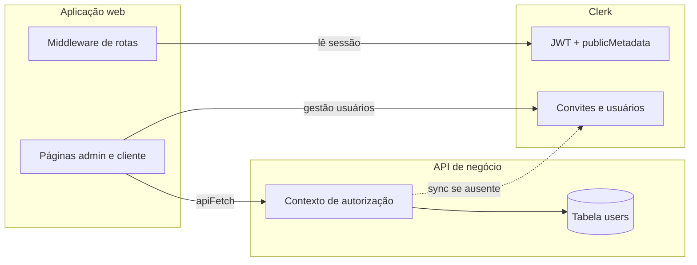

# Feature Specification: Autenticação Restrita e Convites via Clerk

**Feature Branch**: `005-clerk-restricted-invites`  
**Created**: 2026-05-28  
**Status**: Draft  
**Input**: Autenticação restrita (e-mail/senha, sem autocadastro nem OAuth); convites exclusivos de admin; metadados públicos por perfil; aba dedicada de usuários no admin com listagem, criação e edição; fluxo de ativação com definição de senha.

## User Scenarios & Testing *(mandatory)*

### User Story 1 - Aba de usuários: listar, convidar e editar (Priority: P1)

Como administrador, quero uma aba dedicada **Usuários** no painel administrativo que mostre todos os usuários existentes (e-mail, perfil/regra, empresa vinculada quando for Cliente, status de ativação) e me permita convidar novos usuários ou alterar perfil e empresa de quem já existe, sem depender do painel externo do provedor de identidade.

**Why this priority**: Centraliza governança de acesso no produto; é o hub operacional para criar, auditar e corrigir vínculos de usuários.

**Independent Test**: Pode ser testado acessando `/admin/usuarios` (ou equivalente), verificando listagem completa, convite de um Cliente com empresa, edição de um Cliente para outra empresa e confirmação de que metadados refletem na próxima sessão.

**Acceptance Scenarios**:

1. **Given** um administrador autenticado, **When** navega para a aba Usuários, **Then** vê uma página dedicada (não modal) com título e descrição em português.
2. **Given** a aba Usuários, **When** a página carrega, **Then** exibe tabela ou lista com todos os usuários: e-mail, tipo de perfil (Admin / Cliente), empresa (nome ou "—" para Admin), status (ex.: pendente de ativação / ativo).
3. **Given** a aba Usuários, **When** o admin usa a seção de criação na mesma página, **Then** pode selecionar tipo Admin ou Cliente, informar e-mail e, se Cliente, escolher empresa obrigatoriamente, e confirmar convite.
4. **Given** tipo Admin na criação, **When** o formulário é exibido, **Then** o seletor de empresa permanece oculto.
5. **Given** dados válidos na criação, **When** o admin confirma, **Then** o convite é disparado com metadados corretos e a lista é atualizada (incluindo usuário pendente, se aplicável).
6. **Given** um usuário existente na lista, **When** o admin escolhe editar, **Then** pode alterar o tipo de perfil e, para Cliente, a empresa vinculada; e-mail não é editável nesta entrega (identificador estável).
7. **Given** alteração válida salva, **When** o usuário afetado inicia nova sessão, **Then** o acesso segue o perfil e empresa atualizados nos metadados públicos.
8. **Given** tentativa de salvar Cliente sem empresa ou e-mail inválido na criação, **When** o admin submete, **Then** erros inline em português sem persistir alteração inválida.
9. **Given** a listagem principal do admin, **When** carrega, **Then** existe navegação clara para a aba Usuários (link no menu ou botão equivalente).

---

### User Story 2 - Convidado ativa conta e define senha (Priority: P1)

Como usuário convidado, quero receber um e-mail com link de ativação, definir minha senha em uma tela de onboarding e ser autenticado automaticamente na área correta do produto, para começar a usar o sistema sem etapas manuais adicionais.

**Why this priority**: Completa o ciclo de valor do convite; sem ativação o convite não entrega acesso utilizável.

**Independent Test**: Pode ser testado abrindo o link do e-mail de convite, definindo senha e verificando redirecionamento para a área inicial do perfil (admin ou cliente).

**Acceptance Scenarios**:

1. **Given** convite válido enviado, **When** o convidado recebe o e-mail, **Then** o e-mail contém link seguro de ativação.
2. **Given** link de ativação válido, **When** o convidado acessa, **Then** é direcionado à rota de onboarding para definir senha (não cadastro público).
3. **Given** senha definida conforme política do provedor, **When** o convidado submete, **Then** a conta é ativada, o usuário fica autenticado e é redirecionado à dashboard inicial do perfil.
4. **Given** perfil Cliente com empresa nos metadados, **When** o onboarding conclui, **Then** o usuário acessa apenas dados daquela empresa.
5. **Given** link expirado ou já utilizado, **When** o convidado tenta ativar, **Then** recebe mensagem em português orientando a solicitar novo convite ao administrador.

---

### User Story 3 - Acesso bloqueado para cadastro público e login social (Priority: P2)

Como responsável pelo produto, quero que apenas login por e-mail e senha exista e que ninguém consiga se registrar por conta própria ou via redes sociais, para manter controle total sobre quem entra no sistema.

**Why this priority**: Garante a premissa de segurança; complementa convite e gestão na aba Usuários.

**Independent Test**: Verificar tela de entrada sem OAuth nem "criar conta", e usuário sem metadados em acesso pendente.

**Acceptance Scenarios**:

1. **Given** visitante não autenticado, **When** acessa a tela de entrada, **Then** só é oferecido login com e-mail e senha.
2. **Given** visitante não autenticado, **When** tenta cadastro público, **Then** o fluxo não está disponível.
3. **Given** usuário sem metadados válidos após login, **When** autentica, **Then** permanece em acesso pendente com orientação clara.

---

### Edge Cases

- E-mail já existente ao convidar: mensagem clara na aba Usuários, sem duplicar conta.
- Empresa inexistente ou removida na criação/edição de Cliente: bloquear com erro na página.
- Admin edita Cliente para empresa A e depois para B: apenas a empresa atual nos metadados vale; sessões antigas devem refletir após renovação de token/sessão.
- Admin altera Cliente para Admin: metadados removem `companyId`; usuário perde acesso a dados de cliente na próxima sessão.
- Admin altera Admin para Cliente: exige seleção de empresa antes de salvar.
- Usuário pendente de ativação na lista: status visível; edição de perfil/empresa permitida antes da ativação (metadados já corretos no convite).
- Admin tenta editar a si mesmo para remover role admin: política v1 — impedir auto-rebaixamento que deixe o sistema sem admin (mensagem clara).
- Lista vazia (ambiente novo): mensagem amigável e formulário de primeiro convite visível.
- Falha ao carregar usuários do provedor: mensagem de erro na aba com opção de tentar novamente.
- Convidado com `companyId` inválido nos metadados: acesso pendente ou erro controlado, sem vazar outras empresas.
- JWT válido no navegador mas usuário ainda ausente no cadastro interno da API: primeira chamada à API de negócio deve sincronizar perfil a partir do provedor, não retornar erro genérico de não autorizado.
- Admin edita perfil no provedor e no cadastro interno divergem: após edição, ambas as camadas devem exibir o mesmo `role` e `companyId`.

## Divisão técnica de autorização *(obrigatória)*

O Prudens Index separa **identidade** (quem é o usuário e qual o perfil declarado) de **autorização operacional da API** (qual `userId` interno e qual empresa o backend usa nas consultas). As duas camadas devem permanecer **alinhadas**; não são fontes concorrentes de verdade.

### Camada 1 — Provedor de identidade (Clerk)

| Responsabilidade | Descrição |
|------------------|-----------|
| Conta e credenciais | E-mail, senha, convites, ativação |
| Perfil no token | `publicMetadata`: `role` (`admin` \| `client`) e `companyId` (obrigatório para cliente) |
| Navegação web | Decisão de rotas (`/admin`, `/dashboard`, `/acesso-pendente`) a partir do JWT de sessão |
| Gestão admin (origem) | Listagem de usuários/convites e gravação de perfil via operações administrativas do provedor (disparadas só pelo backend) |

**Fonte canônica do perfil**: o `publicMetadata` no Clerk. Qualquer alteração de perfil ou empresa feita pelo administrador MUST ser persistida primeiro (ou simultaneamente) nesse metadado.

### Camada 2 — Cadastro interno `users` (PostgreSQL)

| Responsabilidade | Descrição |
|------------------|-----------|
| Autorização da API | Rotas de negócio (empresas, importações, produtos do cliente) identificam o chamador pelo registro local (`users.id`, `role`, `company_id`) |
| Integridade referencial | Cliente vinculado a `companies.id` já existente no produto |
| Espelho operacional | Mesmos `role` e `companyId` do metadado público, mais `clerk_user_id` e e-mail |

**Regra**: chamadas autenticadas à API de negócio MUST encontrar (ou obter na hora) um registro em `users` coerente com o JWT. Usuário só no Clerk, sem espelho local, não pode consumir a API de negócio com sucesso.

### Sincronização entre as camadas

O sistema MUST manter Clerk e `users` consistentes nos momentos abaixo:

| Momento | Comportamento esperado |
|---------|------------------------|
| Admin envia convite | Metadados definidos no convite (`publicMetadata` do convite) |
| Admin edita usuário ou convite pendente | Atualizar metadado no provedor **e** espelho em `users` quando já existir conta ativa |
| Primeiro login após aceitar convite | Criar ou atualizar linha em `users` a partir do perfil do provedor |
| Requisição à API com JWT válido e sem linha local | Sincronizar uma vez (lazy) antes de autorizar rotas de negócio |

### O que cada parte do produto consulta

- **Web (middleware)**: lê perfil do **JWT** (metadado público na sessão).
- **Web → API de negócio**: envia token; API resolve perfil pelo **`users`** (com sync a partir do Clerk se necessário).
- **Web → API admin de usuários**: backend fala com **Clerk**; após mudança, atualiza **`users`**.

### Implicações para o operador

- Alterar perfil só no painel externo do Clerk, sem passar pela aba Usuários, pode deixar o cadastro interno desatualizado até o próximo login ou sync — a operação oficial de mudança de perfil é a **aba Usuários**.
- Após edição de perfil/empresa, o usuário afetado pode precisar **novo login** para o navegador refletir o JWT; a API de negócio deve refletir a alteração assim que o espelho `users` for atualizado.

## Requirements *(mandatory)*

### Functional Requirements

- **FR-001**: O sistema MUST utilizar autenticação exclusivamente por e-mail e senha através do provedor de identidade já adotado pelo produto.
- **FR-002**: O sistema MUST proibir autocadastro público e autenticação via redes sociais (OAuth) em todas as telas de entrada.
- **FR-003**: Apenas usuários com perfil administrador autenticado MUST acessar a aba Usuários e operações de convite/edição.
- **FR-004**: O painel administrativo MUST oferecer aba ou rota dedicada **Usuários** (página completa, não modal) acessível a partir da navegação principal do admin.
- **FR-005**: A aba Usuários MUST listar todos os usuários com: e-mail, perfil (Admin / Cliente), empresa vinculada (nome legível ou "—"), status de ativação quando disponível.
- **FR-006**: A mesma página MUST incluir formulário de criação (convite) com seletor de tipo Admin ou Cliente; para Cliente, seleção obrigatória de empresa; para Admin, empresa oculta.
- **FR-007**: O formulário de criação MUST exigir e-mail válido antes do envio do convite.
- **FR-008**: A listagem MUST permitir editar usuário existente: alterar perfil (Admin ↔ Cliente) e empresa (obrigatória para Cliente); e-mail MUST permanecer somente leitura na edição.
- **FR-009**: Ao criar (convite), o backend MUST enviar convite com metadados públicos: Admin `{ role: "admin" }`; Cliente `{ role: "client", companyId: "<uuid>" }`.
- **FR-010**: Ao editar, o backend MUST atualizar metadados públicos no provedor de identidade de forma consistente com as regras de perfil e empresa.
- **FR-011**: O provedor MUST enviar e-mail transacional de ativação para novos convites.
- **FR-012**: Convidados MUST completar onboarding (definir senha) antes do primeiro acesso às áreas restritas.
- **FR-013**: Após ativação ou login, redirecionamento MUST seguir perfil: admin → área administrativa; client → dashboard do cliente.
- **FR-014**: Usuários sem metadados válidos MUST permanecer em acesso pendente com mensagem em português.
- **FR-015**: Clientes MUST acessar apenas recursos da empresa em seus metadados públicos.
- **FR-016**: Mensagens de erro, confirmação e rótulos da aba Usuários MUST estar em português (pt-BR).
- **FR-017**: O `publicMetadata` no provedor de identidade MUST ser a fonte canônica de `role` e `companyId`; convites e edições admin MUST gravar esse metadado conforme as regras de perfil.
- **FR-018**: A tabela interna `users` MUST espelhar `role` e vínculo de empresa coerentes com o metadado público para cada `clerk_user_id` ativo.
- **FR-019**: Operações admin de convite e edição MUST atualizar o provedor e o espelho `users` (quando aplicável) na mesma ação de negócio, sem deixar divergência intencional.
- **FR-020**: A API de negócio MUST, ao receber JWT válido sem registro local, sincronizar o usuário a partir do provedor antes de responder com erro de não autorizado, desde que o metadado de perfil seja válido.
- **FR-021**: O middleware da aplicação web MUST continuar a decidir rotas apenas pelo perfil presente no JWT (não pela tabela `users` diretamente).

### Key Entities

- **Usuário**: Conta no provedor de identidade; atributos visíveis ao admin: e-mail, status, metadados de perfil.
- **Perfil Admin**: Metadado `role: admin`; sem empresa; acesso à gestão completa incluindo aba Usuários.
- **Perfil Cliente**: Metadado `role: client` + `companyId`; acesso restrito à empresa referenciada.
- **Empresa**: Entidade existente; exibida por nome na listagem; referenciada por identificador nos metadados.
- **Convite**: Criação inicial de usuário; transição para ativo após definição de senha.
- **Alteração de perfil**: Atualização de metadados em usuário já existente (com ou sem ativação concluída).
- **Espelho `users`**: Registro PostgreSQL alinhado ao Clerk para autorização das APIs de negócio (`clerk_user_id`, `email`, `role`, `company_id`).

## Success Criteria *(mandatory)*

### Measurable Outcomes

- **SC-001**: 100% das novas contas em teste são criadas via convite na aba Usuários (zero autocadastros públicos).
- **SC-002**: Administrador localiza qualquer usuário na listagem (e-mail ou filtro) em menos de 30 segundos em ambiente com até 100 usuários.
- **SC-003**: Administrador convida ou edita perfil/empresa de um usuário em menos de 2 minutos, com confirmação visível na lista.
- **SC-004**: Pelo menos 90% dos convidados concluem ativação na primeira tentativa, sem suporte manual.
- **SC-005**: Usuários Cliente acessam somente dados da empresa nos metadados em 100% dos casos de teste de isolamento, inclusive após edição de empresa.
- **SC-006**: Telas de entrada e onboarding não exibem login social nem "criar conta" pública.
- **SC-007**: Em 100% dos testes de convite e edição, `publicMetadata` no provedor e registro em `users` exibem o mesmo `role` e `companyId` imediatamente após a operação admin.
- **SC-008**: Convidado que conclui ativação consegue chamar a API de negócio na primeira requisição (sem erro 401 por ausência de linha em `users`).

## Assumptions

- O provedor Clerk permanece como provedor de identidade; listagem e edição usam capacidades administrativas do provedor via backend seguro (sem expor chaves no navegador).
- A divisão Clerk (JWT / metadata) vs Postgres (`users`) é intencional e documentada; implementação segue a seção **Divisão técnica de autorização** desta spec.
- Nomes de empresas na listagem são resolvidos a partir do cadastro de empresas já existente no produto.
- Política de senha segue configuração do provedor; admin não redefine senha de outro usuário nesta entrega.
- Primeiro administrador pode existir via bootstrap/seed; aba Usuários cobre usuários subsequentes e manutenção.
- Reenvio manual de convite e exclusão/desativação de conta podem ficar para entrega futura, salvo suporte nativo mínimo do provedor documentado no plano.
- Após edição de metadados, sessão em andamento do usuário afetado pode exigir novo login para o **navegador** refletir o JWT; o espelho `users` deve estar atualizado na hora para a **API de negócio**.
- Custom claim de sessão no Clerk inclui `publicMetadata` (ou `metadata`) para o middleware web.

## Out of Scope

- Autocadastro, waitlist ou registro aberto na internet.
- Login social (Google, Facebook, Apple, etc.).
- Alteração de e-mail de usuário existente.
- Redefinição de senha pelo admin em nome do usuário (usuário usa fluxo do provedor ou "esqueci senha" se habilitado).
- MFA obrigatório nesta entrega.
- Histórico de auditoria detalhado (quem alterou qual usuário e quando) — desejável futuro, não v1.
